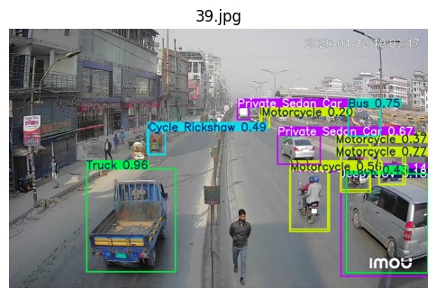

# 🚗 Advanced Vehicle Detection & Tracking System

[](https://github.com/ultralytics/ultralytics)
[](https://www.python.org/)
[](https://developer.android.com/)



A comprehensive solution for real-time vehicle detection, tracking, and counting, featuring both a powerful Machine Learning backend and an intuitive Android mobile application.

---

## 📺 Project Animation


---

## 🌟 Key Features

- **Real-time Detection**: Powered by highly optimized YOLOv8 models.
- **Robust Tracking**: Multi-object tracking (MOT) using SORT/Kalman Filter algorithms.
- **Cross-Platform**: Seamlessly deployable on high-performance PCs and portable Android devices.
- **Training Pipeline**: Full support for local and Kaggle-based model training.
- **Intuitive GUI**: Easy-to-use desktop interface for monitoring and batch processing.

---

## 📂 Project Structure

The repository is divided into two main components:

### 🧠 [ML Engine & Tools (Ml_codes)](file:///c:/Users/user/OneDrive/Desktop/MY%20RESUME/vehicle-detection/Ml_codes/README.md)
*The core brains of the system.*
- **Model Training**: Jupyter notebooks for custom training.
- **Inference Scripts**: Batch video and image annotation.
- **Traffic Monitor**: A real-time GUI for live monitoring.
- **Weights**: Pre-trained `.pt` and `.onnx` models.

### 📱 [Android Application (android_app)](file:///c:/Users/user/OneDrive/Desktop/MY%20RESUME/vehicle-detection/android_app/)
*The portable monitoring solution.*
- **Kotlin/Java Backend**: Efficient mobile integration.
- **Real-time Camera**: Local inference on mobile devices.
- **User Dashboard**: Simple interface for detection results.

---

## 🚀 Quick Start

### Machine Learning Workspace
```bash
cd Ml_codes
pip install -r requirements.txt
python run_gui.py
```

### Android Development
1. Open the `./android_app` folder in **Android Studio**.
2. Sync Project with Gradle Files.
3. Build and Run on your device.

---

## 🧠 Model Training

We provide a full pipeline for training your own vehicle detector:
- **Local**: [train-vehicle-detector.ipynb](file:///c:/Users/user/OneDrive/Desktop/MY%20RESUME/vehicle-detection/Ml_codes/model_train/train-vehicle-detector.ipynb)
- **Cloud**: [Train on Kaggle](https://www.kaggle.com/code/emammame/train-vehicle-detector)

---

## 🛠️ Tech Stack

- **ML Framework**: PyTorch, Ultralytics (YOLOv8)
- **Computer Vision**: OpenCV
- **Backend Logic**: Python
- **Mobile Development**: Kotlin/Java, Android SDK
- **Model Formats**: .pt, .onnx

---

## 🤝 Contributing

Contributions are welcome! Please feel free to submit a Pull Request.

---

*Developed by Emam Hasan*
